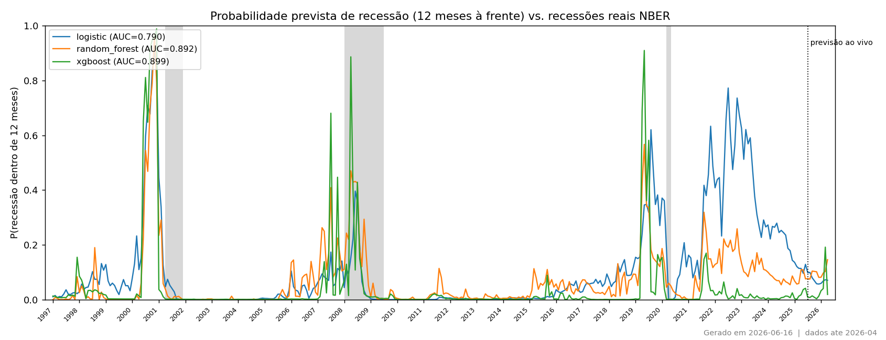
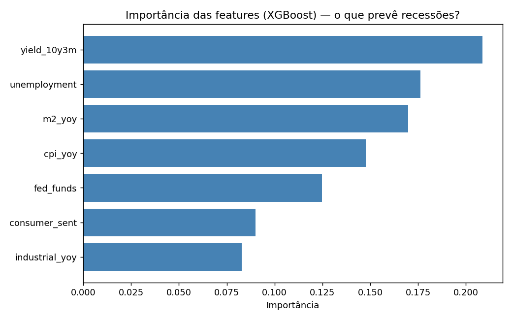
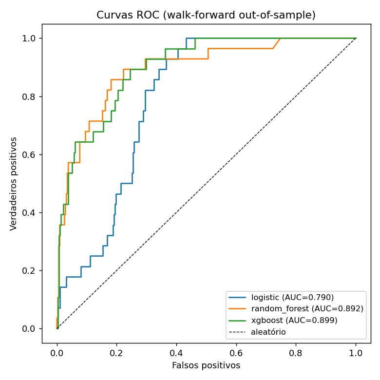

# US Recession Predictor

Prever, com **12 meses de antecedência**, se a economia dos EUA entra em recessão,
usando indicadores macro públicos da FRED desde 1970. O alvo é binário (recessão / expansão),
definido oficialmente pelo NBER.

> **O detalhe técnico que importa:** este projeto usa **walk-forward validation**, não
> cross-validation aleatório. Com séries temporais, treinar com dados futuros e testar no
> passado infla artificialmente as métricas. Aqui, cada previsão é feita usando *apenas*
> dados anteriores a ela.

## Indicadores (features)

| Indicador | FRED ID | Porquê |
|---|---|---|
| Yield Spread 10Y-3M | `T10Y3M` | O preditor de recessão preferido da Fed de NY |
| Taxa de desemprego | `UNRATE` | Lagging mas robusto |
| Produção industrial | `INDPRO` | Proxy leading de atividade* |
| CPI (inflação, YoY) | `CPIAUCSL` | Contexto de política monetária |
| Fed Funds Rate | `FEDFUNDS` | Nível das taxas |
| M2 (variação YoY) | `M2SL` | Liquidez na economia |
| Confiança do consumidor | `UMCSENT` | Expectativas |

\* O PMI ISM (`NAPM`) foi descontinuado na FRED; usamos produção industrial como proxy leading.
O spread 10Y-2Y (`T10Y2Y`) foi testado e **removido** por redundância (correlação 0.86
com o 10Y-3M) — a sua remoção melhorou o AUC (ver Resultados).

**Alvo:** `USREC` (indicador de recessão NBER), deslocado 12 meses → "haverá recessão dentro de 1 ano?".

## Como correr

```bash
pip install -r requirements.txt

# 1. Obter uma FRED API key gratuita:
#    https://fred.stlouisfed.org/docs/api/api_key.html
# 2. Copiar .env.example -> .env e preencher FRED_API_KEY

python run_pipeline.py          # fetch -> features -> train -> evaluate
# ou correr etapas isoladas:
python -m src.fetch_data
python -m src.features
python -m src.train
python -m src.evaluate

python -m src.predict           # previsao ao vivo (texto) num so comando
pytest -q                       # testes (target sem fuga + walk-forward)
```

## Pipeline

```
config.yaml + .env  →  fetch_data.py  →  data/raw/series.parquet
                                              ↓
                       features.py     →  data/processed/dataset.parquet
                                              ↓
                       train.py        →  predictions.parquet  (walk-forward OOS)
                                              ↓
                       evaluate.py     →  reports/figures/*.png
```

## Como atualizar (dados novos)

Os gráficos são "fotografias" — **não se atualizam sozinhos**. Para os refrescar com
os dados mais recentes da FRED (que publica novos meses regularmente):

```bash
python run_pipeline.py          # re-fetch FRED -> retreina -> regenera os graficos
python -m src.predict           # ve a nova previsao em texto
```

A fronteira da "previsão ao vivo" no gráfico **avança sozinha** — é calculada a partir
do último mês com dados, não está fixa. Notas:

- O passado distante fica inalterado; só os últimos ~12-24 meses podem mudar
  ligeiramente (a FRED **revê** dados recentes).
- Meses que hoje estão na zona "ao vivo" passam a histórico com rótulo à medida que o
  desfecho se conhece — por isso a fronteira desloca-se.
- Para refletir os gráficos novos **no GitHub**, é preciso commit & push (ver abaixo):
  ```bash
  git add reports/figures/ && git commit -m "Atualiza graficos" && git push
  ```

## Modelos

1. **Logistic Regression** — baseline interpretável (é o que a Fed de NY usa).
2. **Random Forest** — capta não-linearidades.
3. **XGBoost** — melhor candidato a performance.

**Métrica principal: AUC-ROC** (robusta a classes desbalanceadas — recessões são ~15% dos meses).

## Outputs

- `reports/figures/recession_probability.png` — probabilidade prevista vs. recessões reais (barras cinzentas estilo FRED), com a previsão ao vivo estendida até hoje.
- `reports/figures/roc_curves.png` — curvas ROC dos três modelos.
- `reports/figures/feature_importance.png` — qual indicador mais previu recessões nos últimos 50 anos.

## Resultados

Validação **walk-forward** (out-of-sample, ~1998–2025):

| Modelo | AUC-ROC |
|---|---|
| **XGBoost** | **0.899** |
| Random Forest | 0.892 |
| Logistic Regression | 0.790 |



*Probabilidade prevista (12 meses à frente) vs. recessões reais NBER (barras cinzentas). A linha pontilhada marca o início da previsão ao vivo.*

**Leitura dos resultados:**

- Os modelos sinalizaram as recessões de **2001, 2008 e 2020** com meses de antecedência (a probabilidade prevista sobe antes das barras cinzentas).
- A **inversão da curva de juros de 2022-23** gerou um falso positivo **apenas** na Logistic Regression; XGBoost e Random Forest mantiveram-se baixos — evidência de que os modelos não-lineares foram mais robustos a este sinal ambíguo.
- **Feature importance:** o **spread 10Y-3M** lidera, seguido da taxa de **desemprego**, da variação do M2 e do CPI — confirmando o papel clássico da curva de juros e do mercado de trabalho.
- **Seleção de features:** removi o spread 10Y-2Y por redundância (correlação 0.86 com o 10Y-3M); o AUC do XGBoost **subiu de 0.884 para 0.899**, mostrando que menos features ≠ pior modelo quando há multicolinearidade.
- **Previsão ao vivo:** com os dados mais recentes, o XGBoost estima **~2%** de probabilidade de recessão no próximo ano (território de expansão).

<p align="center">
  
  
</p>

> **Limitação honesta:** como a série `T10Y3M` só existe na FRED desde 1982 e usamos 15 anos de treino mínimo, a janela de teste começa ~1998 — as recessões de 1973, 1981 e 1990 ficam fora da avaliação. Baixar `min_train_months` ou remover `T10Y3M` no `config.yaml` recupera-as.

## Estrutura

```
├── config.yaml            # séries FRED, parâmetros, seeds
├── run_pipeline.py        # orquestrador
├── src/
│   ├── fetch_data.py      # recolha FRED
│   ├── features.py        # transformações + target (lag 12m)
│   ├── train.py           # walk-forward + 3 modelos
│   └── evaluate.py        # métricas + figuras
├── notebooks/             # 01_data_collection → 04_interpretation
├── tests/                 # garante: target sem fuga, walk-forward sem leakage
└── reports/figures/
```
